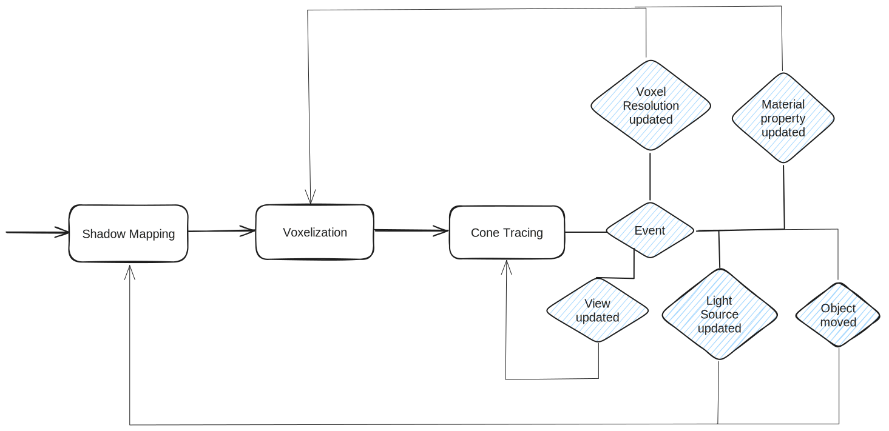
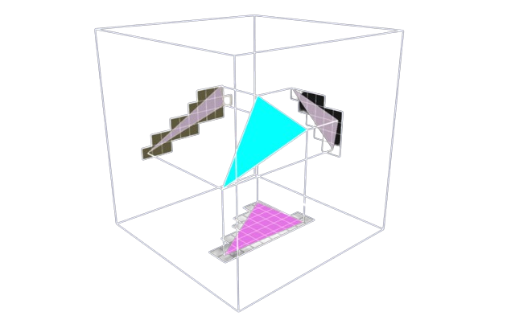
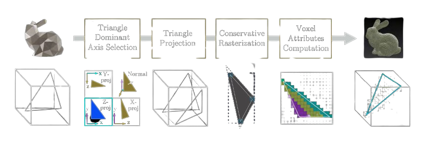
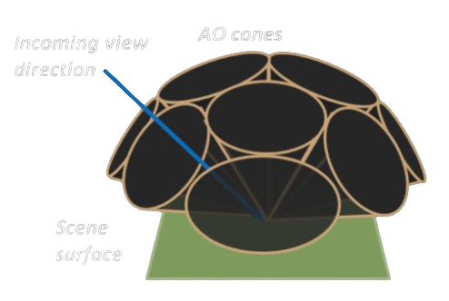
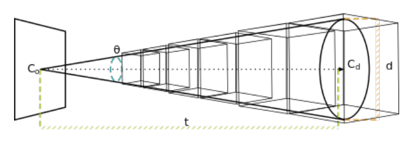
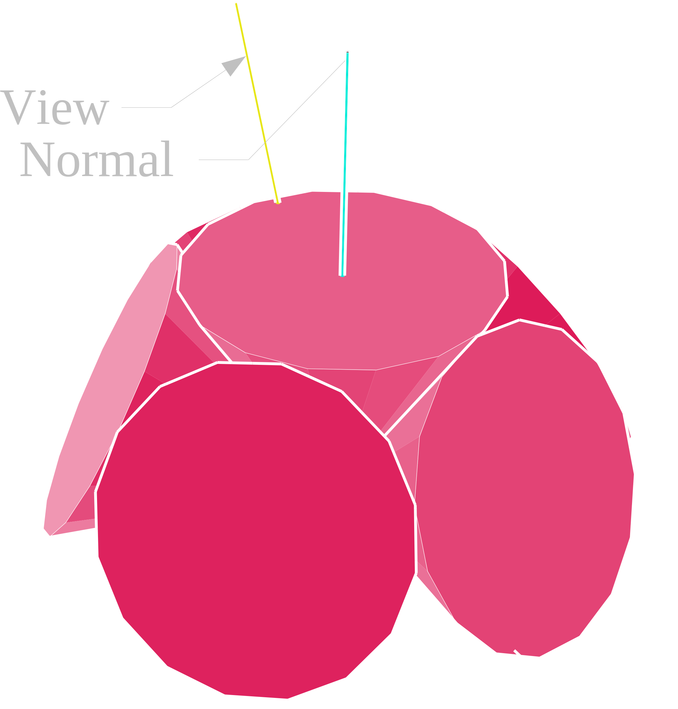
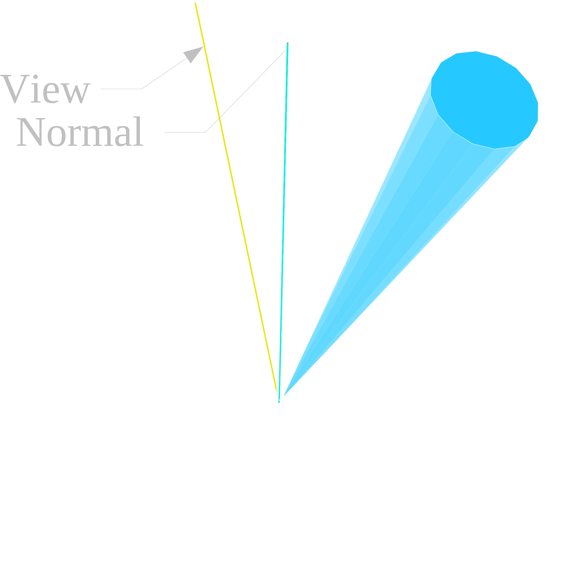
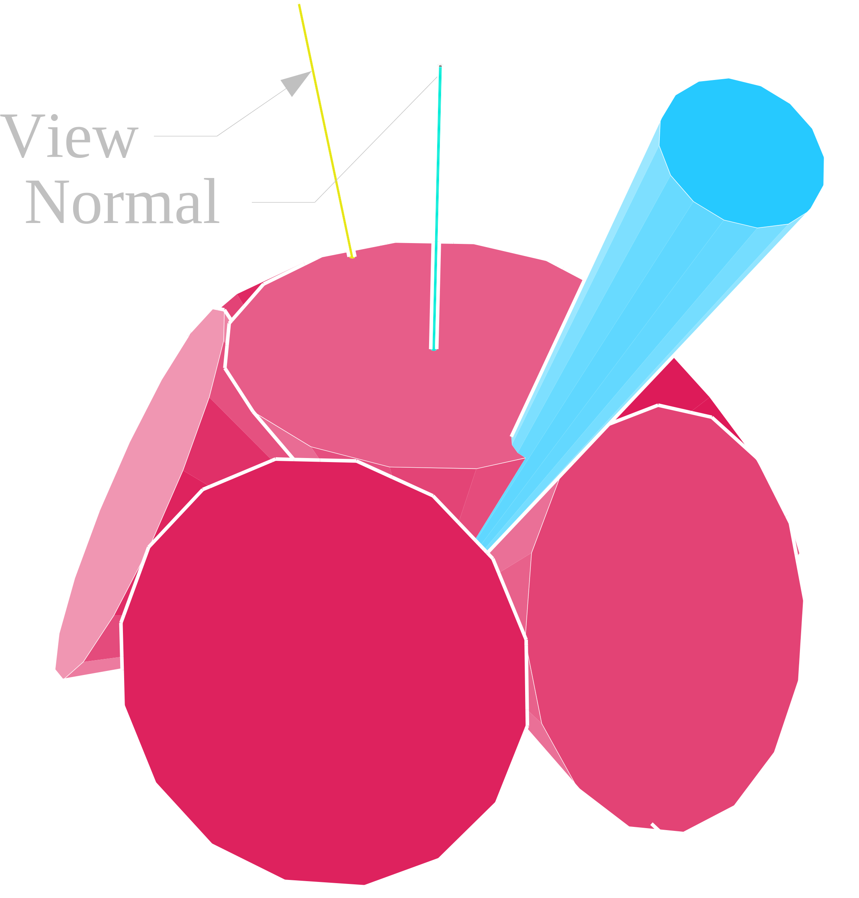
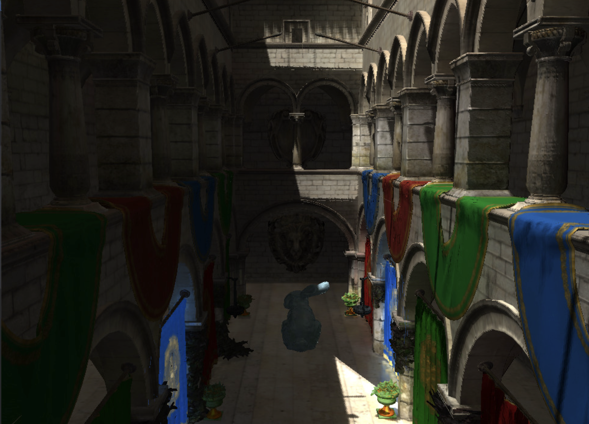
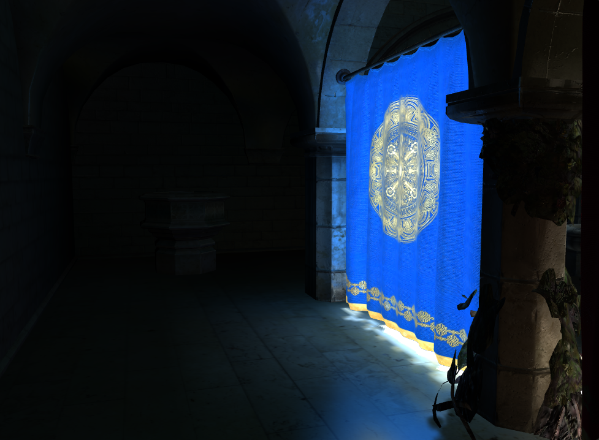

## Real-Time Global Illumination

### (using Voxel Cone Tracing)

---

## Introduction

* Raytracing is slow
* Optimizations:
  * Brute Force: more computing power!
  * Approximation: cone tracing

--- 

## VXGI Pipeline

* Voxelization using the GPU Hardware Rasterizer
* Hybrid Rendering Pipeline
  * Rasterized primary rays for direct lighting
  * Cone Traced secondary rays for indirect GI

---

# THE VXGI ENGINE

---



---

# VOXELIZATION

---

## One Pass Voxelization Pipeline

1. Rasterization
2. Dominant Axis Projection
3. Direct Light Injection and Mipmapping

---

### Rasterization

* Use GPU to generate voxels
* Thin surface voxelization of triangle B with voxel V:
  * B’s plane intersects V
  * 2D projection of B along it's dominant axis intersects the 2D projection of V.
* Disable depth testing (z-buffer)

---

#### Hardware Conservative Rasterization

* Generate fragments for every pixel touched by a primitive
* `GL_NV_conservative_raster` Extension
* NVIDIA’s new Maxwell architecture (2014 onwards)

---

### Dominant Axis Selection


$$l_{\{x,y,z\}} = |n · v_{\{x,y,z\}} |$$

---

### Inside the Geometry Shader

```glsl
...

// select the dominant axis
float axis = max(geometryNormal.x, max(geometryNormal.y, geometryNormal.z));

if (axis == geometryNormal.x) {
    gl_Position = vec4(outputPosition.zy, 1.0, 1.0);
} else if (axis == geometryNormal.y) {
    gl_Position = vec4(outputPosition.xz, 1.0, 1.0);
} else if (axis == geometryNormal.z) {
    gl_Position = vec4(outputPosition.xy, 1.0, 1.0);
}
EmitVertex();

...
```

---

### Direct Lighting and 3D Mipmapping

* Each projected triangle passed through the standard rasterization pipeline to perform 2D scan conversion
* Compute 3D integer coordinate within the destination voxel image
* `imageStore()` (OpenGL 4.2+) to write direct lighting to 3D image
* `glGenerateMipmap()` for automatic mipmap generation

---



---

# CONE TRACING

---

## The Rendering Equation

$$ L_o(\mathbf{p}, \omega_o) = L_e(\mathbf{p}, \omega_o) + \int_{\Omega} f(\mathbf{p}, \omega_i, \omega_o) \cdot L_i(\mathbf{p}, \omega_i) \cdot (\mathbf{n} \cdot \omega_i) \, d\omega_i
$$

---



The hemispherical integration can be represented as a summation of 𝑁 cones

---

$$
L_o(\mathbf{x}, \omega) \approx L_e(\mathbf{x}, \omega) + \frac{1}{N} \sum_{i=1}^{N} V_c(\mathbf{x}, \omega_i)
$$

---

## Raymarching the 3D Mipmap



---

We define the diameter d as:

$$d = 2t \times \tan(\frac{\theta}{2})$$

Mipmap LOD for sampling:
$$V_{\text{level}} = \log_2(\frac{d}{V_{\text{size}}})$$

---

Volumetric front-to-back accumulation:

$$C = \alpha C + (1 - \alpha)\alpha_2C_2$$
$$\alpha = \alpha + (1 - \alpha)\alpha_2$$

---

## Indirect Diffuse Lighting



---

## Indirect Specular Lighting



---

## Complete Global Illumination



---

# RESULTS

---



---


