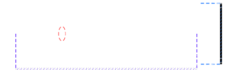

## Real-Time Global Illumination

### (using Voxel Cone Tracing)

---

## Introduction

* Raytracing is slow
* Optimizations:
  * Brute Force: more computing power!
  * Approximation: cone tracing

---

## Motivation

* Video Games!

---

## VXGI Pipeline

* Voxelization using the GPU Hardware Rasterizer
* Hybrid Rendering Pipeline
  * Rasterized primary rays for direct lighting
  * Cone Traced secondary rays for indirect GI

---

# VOXELIZATION

---

## One Pass Voxelization Pipeline

1. Rasterization
2. Dominant Axis Projection
3. 3D Texture Storage and Mipmapping

---
<https://github.com/marp-team/marp-core/tree/main/themes>

### Rasterization

* Use GPU to generate voxels
* Thin surface voxelization of triangle B with voxel V:
  * B’s plane intersects V
  * 2D projection of B along it's dominant axis intersects the 2D projection of V.
* Disable depth testing (z-buffer)

---

### Dominant Axis Selection

$$l_{\{x,y,z\}} = |n · v_{\{x,y,z\}} |$$

---

### 3D Texture and Mipmapping

* `imageStore()` (OpenGL 4.2+) to write direct lighting to 3D image
* `glGenerateMipmap()` for automatic mipmap generation

---

# CONE TRACING

---

## The Rendering Equation

$$ L_o(\mathbf{p}, \omega_o) = L_e(\mathbf{p}, \omega_o) + \int_{\Omega} f(\mathbf{p}, \omega_i, \omega_o) \cdot L_i(\mathbf{p}, \omega_i) \cdot (\mathbf{n} \cdot \omega_i) \, d\omega_i
$$

Voxel Cone Tracing approximates the rendering equation by tracing cones instead of rays.

$$
L_o(\mathbf{x}, \omega) \approx L_e(\mathbf{x}, \omega) + \frac{1}{N} \sum_{i=1}^{N} V_c(\mathbf{x}, \omega_i)
$$

---

Diffuse cones and specular cones are traced to simulate indirect diffuse and specular reflections.

